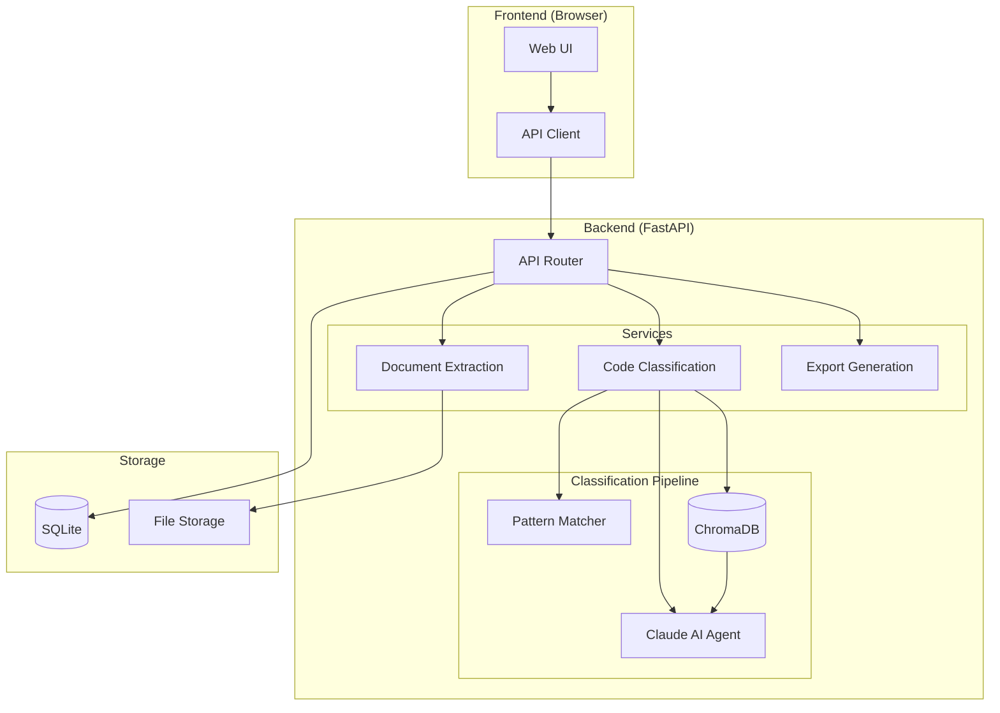

# Payroll Code Automation

[](https://www.python.org/downloads/)
[](https://fastapi.tiangolo.com/)
[](https://www.anthropic.com/)
[](https://opensource.org/licenses/MIT)

An AI-powered document processing application that automates the extraction and classification of payroll codes from various document formats. Built with FastAPI, Claude AI, and ChromaDB for intelligent code categorization using Retrieval-Augmented Generation (RAG).

---

## Table of Contents

- [Overview](#overview)
- [Key Features](#key-features)
- [Tech Stack](#tech-stack)
- [Supported Document Types](#supported-document-types)
- [Output Structure](#output-structure)
- [Demo](#demo)
- [Installation](#installation)
- [Usage](#usage)
- [Project Structure](#project-structure)
- [Architecture](#architecture)
- [Classification Logic](#classification-logic)
- [Future Enhancements](#future-enhancements)
- [Contributing](#contributing)
- [License](#license)
- [Contact](#contact)

---

## Overview

### The Problem

Organizations transitioning payroll systems face a time-consuming challenge: manually reviewing hundreds of payroll code documents to extract, categorize, and validate earnings codes, deductions, tax withholdings, and employer contributions. This process typically involves:

- Reading through PDF payroll registers, Excel spreadsheets, and Word documents
- Manually identifying and extracting payroll codes (REG, OT, 401K, FIT, etc.)
- Categorizing each code into the correct type (earning, deduction, tax, etc.)
- Cross-referencing codes across multiple documents for consistency
- Creating standardized mapping documents for system migration

### The Solution

This application automates the entire workflow using:

1. **Intelligent Document Parsing** - Extracts structured data from PDFs, Excel files, CSV files, and Word documents
2. **AI-Powered Classification** - Uses Claude AI with RAG to accurately categorize payroll codes with confidence scores
3. **Pattern Matching** - Recognizes 30+ common payroll code patterns (REG, OT, 401K, FIT, MCARE, etc.)
4. **Interactive Review UI** - Allows users to review, edit, and approve classifications before export
5. **Standardized Export** - Generates clean, categorized output ready for system integration

---

## Key Features

- **Multi-format Document Support** - PDF, Excel (.xlsx/.xls), CSV, Word (.docx)
- **Session-based Workflow** - Process multiple documents in organized sessions
- **Agentic RAG Classification** - Claude AI uses tools to search knowledge base, analyze patterns, and reason through classifications
- **Confidence Scoring** - Each classification includes a confidence score (0-100%)
- **Duplicate Detection** - Identifies codes appearing across multiple documents
- **Category Filtering** - Filter and review codes by category
- **Inline Editing** - Edit code details, categories, and descriptions directly in the UI
- **Document Approval Workflow** - Review and approve documents before final export
- **YAML/JSON Export** - Export classified codes in structured formats

---

## Tech Stack

### Backend

| Technology | Purpose |
|------------|---------|
| **FastAPI** | Async REST API framework |
| **SQLAlchemy 2.0** | Async ORM with SQLite |
| **Anthropic Claude** | AI-powered code classification |
| **ChromaDB** | Vector store for semantic search (RAG) |
| **pdfplumber** | PDF text extraction |
| **openpyxl** | Excel file processing |
| **python-docx** | Word document parsing |
| **pandas** | Data manipulation and analysis |
| **Pydantic** | Data validation and settings |

### Frontend

| Technology | Purpose |
|------------|---------|
| **Vanilla JavaScript** | Component-based UI architecture |
| **CSS3** | Custom styling with CSS variables |
| **HTML5** | Semantic markup |

### Infrastructure

| Technology | Purpose |
|------------|---------|
| **uvicorn** | ASGI server |
| **aiosqlite** | Async SQLite driver |
| **structlog** | Structured logging |

---

## Supported Document Types

| Format | Extensions | Extraction Method |
|--------|------------|-------------------|
| PDF | `.pdf` | pdfplumber (text + tables) |
| Excel | `.xlsx`, `.xls` | openpyxl + pandas |
| CSV | `.csv` | pandas |
| Word | `.docx` | python-docx |

The application automatically detects document format and applies the appropriate extraction strategy. Multi-sheet Excel files and multi-page PDFs are fully supported.

---

## Output Structure

Extracted and classified payroll codes are structured as follows:

```yaml
codes:
  - code: "REG"
    description: "Regular Pay"
    category: "earning"
    subcategory: "regular_pay"
    confidence: 100.0
    source: "pattern"

  - code: "401K"
    description: "401(k) Employee Contribution"
    category: "pre_tax_deduction"
    subcategory: "retirement"
    confidence: 95.0
    source: "agent"
    tax_exemptions: ["FIT", "SIT"]

  - code: "FIT"
    description: "Federal Income Tax"
    category: "tax"
    subcategory: "federal_income"
    confidence: 100.0
    source: "pattern"
```

### Code Categories

| Category | Description | Examples |
|----------|-------------|----------|
| `earning` | Compensation paid to employees | REG, OT, BONUS, COMM, HOL, VAC, SICK |
| `pre_tax_deduction` | Deductions before tax calculation | 401K, HSA, FSA, MEDF, DENF, VISF |
| `post_tax_deduction` | Deductions after tax calculation | ROTH, SUPPLIFE, LTD, GARN, UNION |
| `employer_contribution` | Employer-paid amounts | 401KMATCH, ERHEALTH, ERDEN, ERLIFE |
| `tax` | Tax withholdings | FIT, SIT, SS, MCARE, FUTA, SUTA |

---

## Demo


*Demo showing: document upload, code extraction, AI classification, and export workflow*

### Sample Data

The `demo_data/` folder contains synthetic sample files for testing:

| File | Description |
|------|-------------|
| `acme_payroll_codes.xlsx` | Complete payroll code reference (3 sheets) |
| `acme_payroll_register.xlsx` | Employee payroll register with earnings/deductions |
| `acme_deduction_codes.csv` | Pre-tax and post-tax deductions |
| `acme_earnings_codes.csv` | Earnings codes |
| `acme_tax_codes.xlsx` | Tax code reference |
| `acme_paystub_sample.xlsx` | Sample employee pay stub |

All sample data uses the fictional company **Acme Industries** with fake employee names and masked SSNs.

---

## Installation

### Prerequisites

- Python 3.11+
- Anthropic API key (for Claude AI classification)

### Setup

1. **Clone the repository**

```bash
git clone https://github.com/yourusername/payroll-code-automation.git
cd payroll-code-automation
```

2. **Create and activate virtual environment**

```bash
# Windows
cd backend
python -m venv .venv
.venv\Scripts\activate

# macOS/Linux
cd backend
python -m venv .venv
source .venv/bin/activate
```

3. **Install dependencies**

```bash
pip install -r requirements.txt
```

4. **Configure environment variables**

```bash
# Copy example env file
cp .env.example .env

# Edit .env and add your Anthropic API key
ANTHROPIC_API_KEY=your_api_key_here
```

5. **Start the application**

```bash
# From backend directory
python -m uvicorn app.main:app --host 0.0.0.0 --port 8080 --reload
```

6. **Access the application**

Open your browser to `http://localhost:8080`

---

## Usage

### Workflow

1. **Create Session** - Start a new payroll code extraction session
2. **Upload Documents** - Drag and drop or select payroll documents (PDF, Excel, CSV, Word)
3. **Extract Codes** - System automatically parses documents and extracts potential payroll codes
4. **Review Classifications** - AI classifies each code with category, confidence score, and reasoning
5. **Edit & Approve** - Review codes, make corrections, and approve documents
6. **Export** - Download classified codes in YAML or JSON format

### Using Sample Data

```bash
# Navigate to demo_data folder
cd demo_data

# Upload any of the sample files to test the application
# Recommended: acme_payroll_codes.xlsx (contains ~35 codes across 3 sheets)
```

### API Endpoints

| Endpoint | Method | Description |
|----------|--------|-------------|
| `/api/v1/sessions` | POST | Create new session |
| `/api/v1/documents/upload` | POST | Upload document |
| `/api/v1/documents/{id}/extract` | POST | Extract codes from document |
| `/api/v1/codes/document/{id}` | GET | Get codes for document |
| `/api/v1/codes/{id}` | PUT | Update code classification |
| `/api/v1/codes/document/{id}/approve` | POST | Approve document codes |
| `/api/v1/generate/export` | POST | Export codes to YAML/JSON |

---

## Project Structure

```
payroll-code-automation/
├── backend/
│   ├── app/
│   │   ├── api/
│   │   │   └── endpoints/       # API route handlers
│   │   │       ├── codes.py     # Code CRUD operations
│   │   │       ├── documents.py # Document upload/extract
│   │   │       ├── generate.py  # Export functionality
│   │   │       ├── health.py    # Health checks
│   │   │       └── sessions.py  # Session management
│   │   ├── core/
│   │   │   ├── config.py        # Application settings
│   │   │   └── database.py      # SQLAlchemy setup
│   │   ├── models/
│   │   │   ├── code.py          # Code model
│   │   │   ├── document.py      # Document model
│   │   │   └── session.py       # Session model
│   │   ├── services/
│   │   │   ├── classification/
│   │   │   │   ├── agentic_classifier.py  # Claude AI with tools
│   │   │   │   ├── knowledge_base.py      # Payroll code knowledge
│   │   │   │   ├── patterns.py            # Regex pattern matching
│   │   │   │   └── vector_store.py        # ChromaDB RAG
│   │   │   ├── extraction/
│   │   │   │   ├── excel_extractor.py     # Excel parsing
│   │   │   │   ├── pdf_extractor.py       # PDF parsing
│   │   │   │   └── docx_extractor.py      # Word parsing
│   │   │   └── generation/
│   │   │       └── yaml_generator.py      # Export generation
│   │   └── main.py              # FastAPI application
│   ├── requirements.txt
│   └── .env.example
├── frontend/
│   ├── css/
│   │   └── styles.css           # Application styles
│   ├── js/
│   │   ├── api.js               # API client
│   │   ├── app.js               # Main application logic
│   │   └── components.js        # UI components
│   └── index.html               # Single-page application
├── demo_data/
│   ├── generate_samples.py      # Sample data generator
│   ├── README.md                # Sample data documentation
│   └── *.xlsx, *.csv            # Sample files
├── .github/
│   ├── docs/assets/demo.gif     # Demo animation
│   ├── README.md                # This file
│   └── LICENSE                  # MIT License
└── .gitignore
```

---

## Architecture



### Data Flow

1. **Upload** - Documents are uploaded via the REST API and stored in the file system
2. **Extraction** - Document type is detected and appropriate extractor parses the content
3. **Pattern Matching** - Extracted codes are matched against 30+ known payroll code patterns
4. **RAG Classification** - Unmatched codes are classified using Claude AI with vector store context
5. **Storage** - Codes are stored in SQLite with classification metadata
6. **Review** - Users review, edit, and approve codes through the web UI
7. **Export** - Approved codes are exported in YAML or JSON format

---

## Classification Logic

The application uses a tiered classification approach:

### Tier 1: Pattern Matching (Fastest)

Regex patterns match common payroll codes with 100% confidence:

```python
# Examples from patterns.py
"^REG(ULAR)?$"           -> earning (regular_pay)
"^OT[0-9]*$"             -> earning (overtime)
"^401K?(\\s*EE)?$"       -> pre_tax_deduction (retirement)
"^FIT$"                  -> tax (federal_income)
"^MCARE$"                -> tax (medicare)
```

### Tier 2: Agentic RAG Classification (Most Accurate)

For codes not matching patterns, Claude AI uses the ReAct pattern:

1. **Search** - Query ChromaDB for similar codes in the knowledge base
2. **Analyze** - Examine code patterns, prefixes, and naming conventions
3. **Lookup** - Retrieve category definitions and examples
4. **Reason** - Generate classification with detailed reasoning
5. **Verify** - Cross-reference with similar codes for consistency

### Confidence Scoring

| Source | Confidence Range | Description |
|--------|------------------|-------------|
| `pattern` | 90-100% | Exact or regex pattern match |
| `agent` | 70-95% | AI classification with RAG |
| `manual` | 100% | User-verified classification |

---

## Future Enhancements

- [ ] **Batch Processing** - Process multiple documents in parallel
- [ ] **Custom Pattern Library** - Allow users to define organization-specific patterns
- [ ] **Export Templates** - Customizable export formats for different target systems
- [ ] **Code Consolidation** - Automatically merge similar codes (e.g., MEDF + MEDS -> MEDICAL)
- [ ] **Audit Trail** - Track all classification changes with user attribution
- [ ] **Multi-tenant Support** - Support multiple organizations with isolated data
- [ ] **API Authentication** - JWT-based authentication for production deployment
- [ ] **Webhook Integrations** - Notify external systems when processing completes

---

## Contributing

Contributions are welcome! Please follow these steps:

1. Fork the repository
2. Create a feature branch (`git checkout -b feature/amazing-feature`)
3. Commit your changes (`git commit -m 'Add amazing feature'`)
4. Push to the branch (`git push origin feature/amazing-feature`)
5. Open a Pull Request

### Development Setup

```bash
# Install dev dependencies
pip install -r requirements-dev.txt

# Run tests
pytest

# Run linter
ruff check .

# Format code
black .
```

---

## License

This project is licensed under the MIT License - see the [LICENSE](LICENSE) file for details.

---

## Contact

**Brandon Paulsen**

- GitHub: [@yourusername](https://github.com/yourusername)
- LinkedIn: [Your LinkedIn](https://linkedin.com/in/yourprofile)
- Email: your.email@example.com

---

*Built with FastAPI, Claude AI, and ChromaDB*
